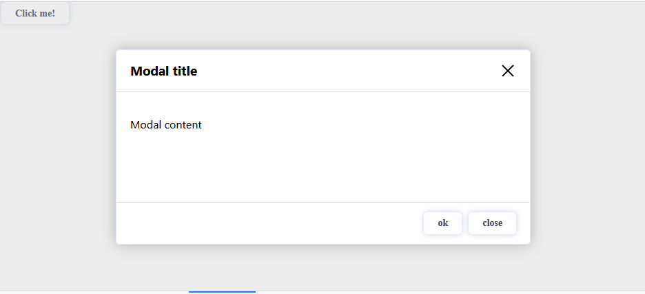

# ReactModalFz

ReactModalFz is a modal library, is wrritten in Javascript. It is a minimal library without any other dependencies, while being performant and straightforward to use, requiring developers to write fewer lines of code than other form libraries.

A library of React components created using `create-react-app`.

# Demo



# Installation

Install ReactModalFz with npm
````javascript
npm install ReactModalFz
````
# Example
````javascript
import React, { useState } from 'react'
import 'ReactModalFz/dist/index.css'
import { Modal } from 'ReactModalFz'

const App = () => {
const [isOpen, setIsOpen] = useState(0)

return (
      <Modal
         isOpen={isOpen}
         onClose={setIsOpen}
         title='Modal title'
         width='600px'
         modalContent={<p>Modal content</p>}
         footerContent={
            <>
               <button className='btn-modal'>ok</button>
               <button className='btn-modal'
                  onClick={() => setIsOpen(isOpen ? 0 : 1)} >
                  close
               </button>
            </>
         }
      />
)}
````

## Props

| Name            | Type          | Required | Description                                                              | Default value     |
| --------------- | ------------- | -------- | ------------------------------------------------------------------------ | ----------------- |
| title | `string` | `Required`   | `Modal title`|  `""` |
| width | `string` | `Optinal`  | `Modal width`|  `""` |
| onClose | `function` | `Required`   | `on click : close modal`|  |
| modalContent    | `Required`  | `true`   | Content of the body of the modal                                                     | `{<p></p>}`              |
| footerContent   | `Optional` | `false`  | buttons to add to the footer        | `{<button></button>}`                                                                       |
| isOpen        | `number`     | `Required`  | if isOpen=1 the modal is displayed

              
## Running Tests

To run tests, run the following command

```bash
  npm run test
``` 